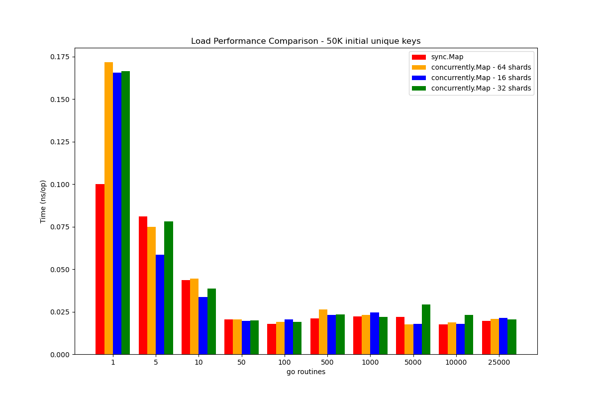
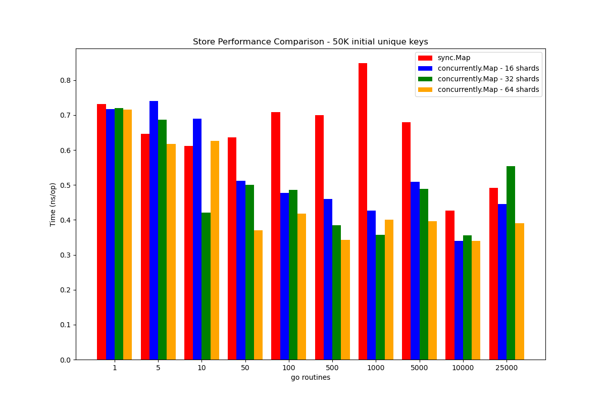
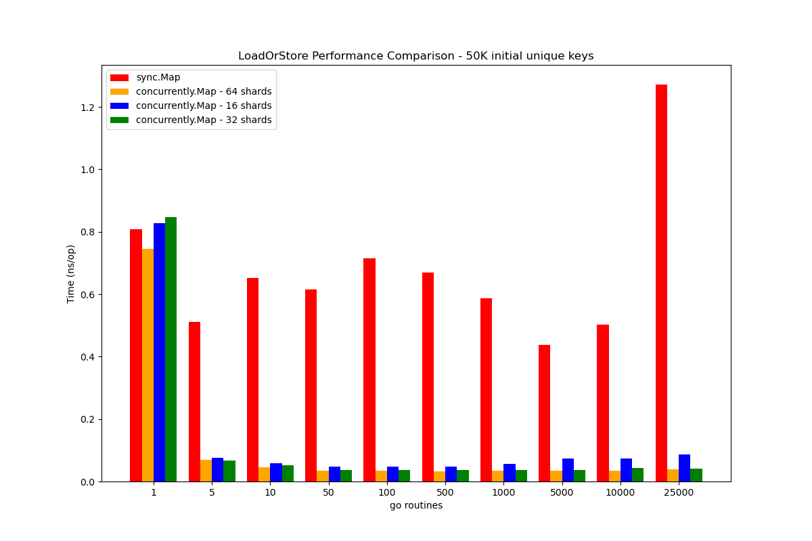
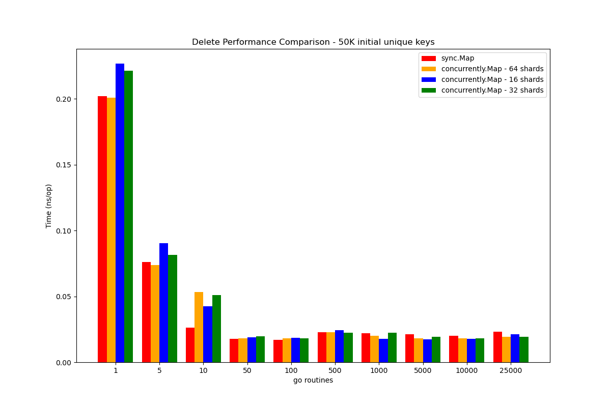

# concurrently
`concurrently` is a high-performance Go package that provides a concurrent map implementation. 

It is specifically designed to excel in high concurrency scenarios with a large number of write operations, such as storing values using `Store` or `LoadOrStore` methods.

**Key Features:**
- A `sync.Map` wrapper optimized for high concurrency scenarios with write operations.
- Provides improved performance compared to traditional `sync.Map` under heavy concurrent loads.

## Installation:
To install the `concurrently` package, use the following command:
```shell
go get github.com/himelbrand/concurrently
```

## Benchmark Results

We conducted benchmarks comparing the performance of `concurrently` with traditional maps under high concurrency scenarios with significant write operations. The results demonstrated that `concurrently` provides substantial performance improvements in these scenarios.

### Disclaimer:
These benchmark results are based on the initial set of benchmarks conducted with string keys. More comprehensive benchmarks with various data types and scenarios are planned for future iterations.

<div class="image-container">
  
  
</div>
<div class="image-container">
  
  
</div>
<style>
.image-container {
  display: flex;
  justify-content: space-arround;
  margin-bottom:15px;
}
.inline-image {
  max-width: 40%; /* Adjust the width as needed */
}
</style>


## Usage:
Import the `concurrently` package into your Go code:
```go
import "github.com/himelbrand/concurrently"
```


### Creating a Concurrent Map:
To create a new concurrent map, use the NewMap function, which allows you to specify the number of shards to use. 

If no value is provided, the default number of shards is 64.

```go
// Create a concurrent map with 16 shards
cm := concurrently.NewMap(16)

// Create a concurrent map with the default number of shards (64)
cmDefault := concurrently.NewMap()
```

## Just like sync.Map Usage:
**From this point it pretty much identical to the usage of** `sync.Map`

### Storing Key-Value Pairs:
To store key-value pairs in the concurrent map, use the `Store` method:
```go
cm.Store("key", "value")
```
### Loading a Value:
To load a value associated with a key from the concurrent map, use the `Load` method:
```go
value, ok := cm.Load("key")
if ok {
    // Value exists
    fmt.Println(value)
} else {
    // Value not found
}
```

### Loading or Storing a Value:
To load a value associated with a key from the concurrent map, or store a new value if the key does not exist, use the `LoadOrStore` method:
```go
actual, loaded := cm.LoadOrStore("key", "new-value")
if loaded {
    // Existing value was loaded
    fmt.Println(actual)
} else {
    // New value was stored
    fmt.Println("Value stored successfully")
}
```

### Deleting a Key-Value Pair:
To delete a key-value pair from the concurrent map, use the `Delete` method:
```go
cm.Delete("key")
```

### Iterating over Key-Value Pairs:
To iterate over all key-value pairs in the concurrent map, use the `Range` method:
```go
cm.Range(func(key, value interface{}) bool {
    // Process key-value pair
    fmt.Println(key, value)

    // Return true to continue iterating or false to stop
    return true
})
```

## Contributing:
Contributions to `concurrently` are welcome! If you find any issues or have suggestions for improvements, please open an issue or submit a pull request on the GitHub repository: https://github.com/himelbrand/concurrently

## License:
This package is licensed under the MIT License.
